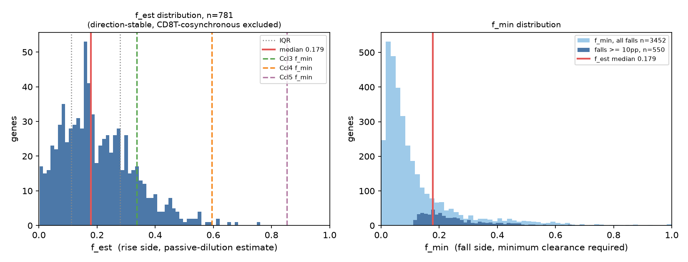
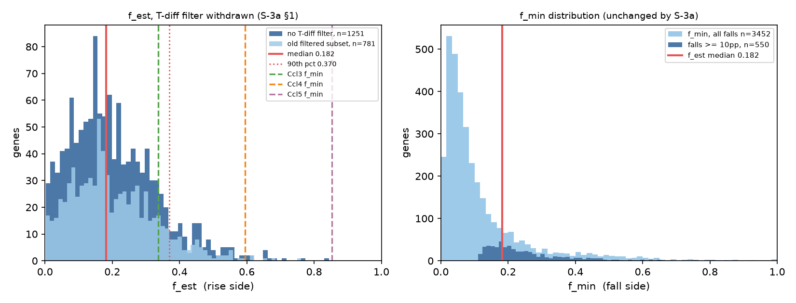

# CLEARANCE_BOUNDS.md —— S-3 §2：清除比例的两侧约束

> ## ⚠ 贯穿全文的限制（§7，置于开头）
> **Kaede 的绿／红对比无法区分「清除」与「重编程」。** 本文件给出的是「**若为清除，需要多大比例**」，以及「**该比例解释不了多少**」，**不是**「是清除」。任何把本文件的 f 值读作「实际清除了这么多细胞」的用法都超出了本设计能支撑的范围。

---

## 0. 两条必须先说的数据事实

### 0.1 `GSE221064` 不在盘上，本轮未取数

交接语称数据为「**已有的 `GSE221064`**」。核查结果：**该数据集从未下载，`data/raw/` 下无任何相关文件。** 项目既有记录与此一致：

- `DATASETS.md`：`GSE221064`（Dean，MC38 Kaede）—— **`NOT_RUN`**，「仅 filtered matrix → 判据 (a) 已知不通过。原始 FASTQ 在 `PRJNA912695`」。
- `NK趋化因子跨区室调查规范-v1.0.md` §候选清单同样记为仅有 filtered matrix。

因此 **§2 全部在 `E-MTAB-10176`（Kaede，24 h／72 h）上执行**，即 §0 所称「必要时补」的那一个。这不是替代选择，是唯一可执行的选择。**`GSE221064` 的取数与否请裁定**——若要在其上复现，需要一次新下载，超出本任务 §1「不检索、不下载」的边界。

### 0.2 §2.4 的两项要求在本数据集上无法按原文执行

| §2.4 要求 | 本数据集的状况 | 本文件的替代做法 |
|---|---|---|
| 「通过**信噪比门槛**的基因」 | **无法构造该门槛。** 四个文库为 `MH1_G24`、`MH2_R24`、`MH3_G72`、`MH4_R72`——**每个颜色×时点恰好一个文库，全库无同色复孔**，故技术噪声底在本数据集内不可估。项目已有的噪声锚（`Xcl1` ±15.5、`Ccl4` ±11.3、`Ccl5` ±6.6 pp）来自 **`GSE221064` 的绿-绿复孔**，A1.3c 明令不得迁移 | 改用本项目自身的**可测性带**作门槛：两侧检出率均 ≥ 5%（不在地板带），且较大一侧阳性细胞数 ≥ 10。**门槛是声明的，不是调出来的** |
| 「自助法区间（**按文库重抽，三个文库**）」 | **不可执行。** 颜色与文库完全共线，重抽文库等于重抽颜色 | 改为**在颜色×时点内重抽细胞**（2000 次）。所得区间**只含抽样不确定度**，**是真实不确定度的下界**——它看不见文库间与个体间方差 |

**「三个文库」这一表述本身指向 `GSE221064`**（GEO 列 3 个样本：绿 ×2 + 红 ×1）。`E-MTAB-10176` 是 4 个文库，且无同色复孔。

### 0.3 因此新增的一层设计：两个时点分别报告

本数据集有 24 h 与 72 h 两个时点，**每个时点是一对独立的绿-vs-红比较**。这是该数据集能提供的、最接近复制的东西。全文对每个基因同时给出合并值与两个时点的分别值，**两时点方向是否一致单列一栏**——不一致本身即为结果。

---

## 1. §2.3 粗算的复核

方法：`raw.X`（对数归一化，16,227 基因）、`main_celltype == "NK"`（1,035 个细胞：绿 385 / 红 650）、检出定义为表达值 > 0。

#### 表 1 —— §2.3 粗算复核

| 基因 | §2.3 绿% | §2.3 红% | §2.3 f | 实测绿% | 实测红% | **实测 f** | f 偏移 | 方向一致 | 24 h f | 72 h f | 方向逐时点稳定 | §2.4 排除？ |
|---|---|---|---|---|---|---|---|---|---|---|---|---|
| **Ccl4** | 37.85 | 12.28 | 0.291 | 70.13 | 26.15 | **0.596** | +0.304 | 是 | 0.654 | 0.584 | 是 | 否 |
| **Ccl3** | 12.59 | 2.8 | 0.101 | 40.26 | 9.85 | **0.337** | +0.237 | 是 | 0.387 | 0.323 | 是 | 否 |
| **Ccl5** | 90.62 | 36.52 | 0.852 | 90.39 | 34.62 | **0.853** | +0.001 | 是 | 1.000 | 0.809 | 是 | 否 |
| **Itga1** | 8.76 | 19.34 | 0.547 | 8.31 | 29.23 | **0.716** | +0.169 | 是 | 0.688 | 0.733 | 是 | **是** |
| **Cd160** | 7.78 | 17.24 | 0.549 | 9.87 | 16.15 | **0.389** | -0.160 | 是 | 0.024 | 0.530 | **否** | **是** |
| **Ldha** | 75.07 | 88.93 | 0.156 | 70.13 | 75.54 | **0.072** | -0.084 | 是 | 0.064 | 0.073 | 是 | 否 |
| **Xcl1** | 76.02 | 81.95 | 0.072 | 49.35 | 57.38 | **0.140** | +0.068 | 是 | 0.149 | 0.150 | 是 | 否 |

### 1.1 复核结论：**方向全部成立，f 值大幅移动，核心论据不成立**

1. **七个基因的升降方向全部与 §2.3 一致。** 这一层稳固。
2. **f 值有五个发生实质性移动**，最大 +0.304（`Ccl4`：0.291 → **0.596**）与 +0.237（`Ccl3`：0.101 → **0.337**）。`Ccl5` 几乎不动（0.852 → 0.853）。
3. > ### **§2.3 的核心论据——`Itga1` 与 `Cd160` 收敛于 ≈ 0.55——不成立。**
   > 实测为 **0.716 与 0.389**，相差 **0.33**。§2.3 中两者仅差 0.002 的近乎重合，是那组输入数值的性质，不是本数据集的性质。
4. **更强的一层：这两个基因都被 §2.4 自己的规则排除。** §2.4 规定「与 CD8 T 同步上升的基因不能用于估计 f」。实测两者均与 CD8 T 同向且幅度过半：
   - `Itga1`：NK 上升 20.9 pp，CD8 T 同向上升 16.5 pp（CD49a 是两类细胞共用的驻留标记，同向本在预期之内）
   - `Cd160`：NK 上升 6.3 pp，CD8 T 同向上升 7.2 pp——**CD8 T 升得比 NK 还多**

   **即：支撑「存在一个自洽清除比例」的两个基因，按本规范自己的判据都不可用。**
5. **`Cd160` 的方向在两个时点间翻转**：24 h 为**降**（绿 11.3% > 红 9.2%），72 h 为**升**（绿 9.4% < 红 20.0%）。合并后的 f_est = 0.389 是这两个相反结果的平均，不是一个稳定量。
6. **`Xcl1` 的绝对水平与 §2.3 相差甚远**（绿 76.02/81.95 对实测 49.35/57.38）。方向一致（持平偏升），f 从 0.072 变为 0.140。

### 1.2 关于「T差」的一处定义问题，需裁定

§2.3 给出 `Ccl4` 的 T差 −0.03、`Ccl3` 0.87、`Ccl5` 25.58。本文件把 T差 明确定义为 **(绿 − 红)_NK − (绿 − 红)_CD8T，单位百分点**，实测为 `Ccl4` **+55.8**、`Ccl3` **+38.0**、`Ccl5` **+37.6**。

在该定义下，§2.3 对 `Ccl4` 的注解**内部不自洽**：T差 ≈ 0 意味着两类细胞变化幅度相同，即**完全趋同**，而注解写的是「几乎零趋同」。`Ccl5` 的 25.58 与「趋同近半」倒是自洽（54.1 pp 的一半约 27）。**故 §2.3 的三个 T差 很可能不是同一个尺度上的量**（其一或为 log2FC 单位）。此处不擅自替原文选定义，只声明本文件所用的定义并如实给出实测值。

---

## 2. 五个募集因子与关键对照

#### 表 2 —— 五个募集因子与关键对照（实测，合并两时点）

| 基因 | 方向 | 绿 | 红 | Δ(pp) | **f** | 95% 抽样区间 | T差(pp) | 逐时点稳定 | §2.4 排除 |
|---|---|---|---|---|---|---|---|---|---|
| **Ccl3** | 降 | 0.403 | 0.098 | +30.4 | **f_min = 0.337** | [0.282, 0.393] | +38.0 | 是 | 否 |
| **Ccl4** | 降 | 0.701 | 0.262 | +44.0 | **f_min = 0.596** | [0.528, 0.657] | +55.8 | 是 | 否 |
| **Ccl5** | 降 | 0.904 | 0.346 | +55.8 | **f_min = 0.853** | [0.806, 0.897] | +37.6 | 是 | 否 |
| **Xcl1** | 升 | 0.494 | 0.574 | -8.0 | **f_est = 0.140** | [0.035, 0.241] | -13.4 | 是 | 否 |
| **Itga1** | 升 | 0.083 | 0.292 | -20.9 | **f_est = 0.716** | [0.612, 0.803] | -4.5 | 是 | **是** |
| **Cd160** | 升 | 0.099 | 0.162 | -6.3 | **f_est = 0.389** | [0.147, 0.578] | +0.9 | **否** | **是** |
| **Ldha** | 升 | 0.701 | 0.755 | -5.4 | **f_est = 0.072** | [0.009, 0.146] | -4.8 | 是 | 否 |
| **Ifng** | 降 | 0.652 | 0.386 | +26.6 | **f_min = 0.433** | [0.349, 0.515] | +50.1 | 是 | 否 |
| **Sell** | 降 | 0.818 | 0.718 | +10.0 | **f_min = 0.354** | [0.187, 0.505] | -12.6 | 是 | **是** |
| **Klrg1** | 降 | 0.109 | 0.083 | +2.6 | **f_min = 0.028** | [0.002, 0.127] | -0.3 | 是 | **是** |

`f_min` = (绿 − 红)/(1 − 红)，下降侧的**下限**；`f_est` = 1 − 绿/红，上升侧的点估计。区间为颜色×时点内重抽细胞 2000 次的 2.5–97.5 百分位（**仅抽样不确定度，为下界**）。

---

## 3. 全基因扫描

门槛：两侧检出率 ≥ 5%，且较大一侧阳性细胞数 ≥ 10 → **6,753 / 16,227 个基因通过**（其中 259 个有一侧触及 85% 天花板带）。

| 类别 | 基因数 |
|---|---|
| 下降侧（给 f_min） | 4,713 |
| 上升侧、可用于 f_est | **1,261** |
| 上升侧、因与 CD8 T 同步而排除 | **779** 〔**该排除已于 S-3a §1 撤销**，见 S-3a-1〕 |
| 上升侧中方向在两时点均稳定 | 781 / 1,261（61.9%） |
| 下降侧中方向在两时点均稳定 | 3,452 / 4,713（73.2%） |

### 3.1 f_est 的分布

> **【S-3a 更新】本小节的数字来自**筛过 T差**的口径。该筛选已于补丁 S-3a §1 撤销；不筛的重出结果见本文件 S-3a-1.2，两者并列。以下为 S-3 原文，保留不改。**

| 集合 | n | 中位数 | 四分位距 | 10–90% |
|---|---|---|---|---|
| 全部可用上升基因 | 1,261 | 0.128 | **0.173** | [0.017, 0.331] |
| **仅方向稳定者（主口径）** | **781** | **0.179** | **0.167** | [0.058, 0.367] |
| 方向稳定且未触天花板 | 776 | 0.181 | 0.167 | [0.060, 0.367] |

三个口径彼此接近，**f_est 的集中位置在 0.13–0.18 之间**。

### 3.2 f_min 的分布（方向稳定、且降幅 ≥ 10 pp 者，n = 550）

中位数 **0.214**，90 百分位 **0.429**，最大 **0.853**（`Ccl5`）。

---

## 4. §2.5 的预写判读

以 f_est 主口径（方向稳定，n = 781）：**中位数 0.179，四分位距 0.167**。

> ### 判读落在预写表的**第二行**：
> **上升侧 f_est 集中，但低于某些基因的 f_min → 该清除比例解释不了这些基因，差额必须由状态改变承担。**

**落在第二行的量化依据：**

- 降幅 ≥ 10 pp 的 550 个基因中，**378 个（68.7%）的 f_min 高于 f_est 中位数 0.179**。
- 三个募集因子**全部**高于：`Ccl3` 0.337、`Ccl4` 0.596、`Ccl5` **0.853**——分别是 f_est 中位数的 1.9 倍、3.3 倍、4.8 倍。
- 若真的取 f = 0.179，且被清除的细胞**全部**为阳性（对清除解释最有利的极端），则它能解释的下降份额为：`Ccl5` **3.7%**、`Ccl4` **14.8%**、`Ccl3` **42.7%**。

> **也就是说：在这套数据里，清除解释力最弱的地方，恰好就是本假说所关心的募集模块本身。**
> `Ccl5` 的下降需要清掉 **85%** 的瘤内 NK 才能单独解释；上升侧给出的自洽比例只有约 **18%**。

### 4.1 判读所依赖的一处阈值，须声明

> **【S-3a 更新】该门槛已由补丁 S-3a §2 回填为「四分位距 > 0.30 判为发散」，并附非盲声明与四档对照，见本文件 S-3a-2 节。以下为 S-3 原文，保留不改。**

§2.5 只写了「集中」与「发散」，**未给数值门槛**。本文件采用 **四分位距 > 0.25 判为发散**，这是**我的选择，不是预注册量**。三个口径的四分位距均为 0.167–0.173，落在门槛下方，故判「集中」。**若门槛取 0.15，则判「发散」，判读改落第三行**（被动上升解释不成立，本路径无效）。

**须注意：第二行与第三行的实用后果不同**——第二行给出一个可用于 §4 的差额，第三行则宣告本路径无效。此处请裁定门槛，或改为不设门槛、只报分布。

**但有一点与门槛无关**：无论 f_est 判「集中」还是「发散」，其整个分布（10–90 百分位 [0.058, 0.367]）的**上端 0.367 仍低于 `Ccl4` 的 0.596 与 `Ccl5` 的 0.853**。**「清除解释不了募集因子的下降」这一结论不依赖该门槛。**

---

## 5. 未做（S-3）

- 未断言下降由清除造成（§1）
- 未用本数据证明假说；本文件只给约束
- 未引入 §0 两个数据集以外的任何数据；**未下载 `GSE221064`**
- 未改动既有分析与结论文件
- 未把「仅抽样」的自助法区间当作 §2.4 所要求的文库层级区间使用

产出：`results/s3_ppt_recheck.csv`、`results/s3_clearance_per_gene.csv`、`results/s3_verdict.txt`、`S3_PLOTS/f_distributions.png`；脚本 `scripts/s3_clearance_bounds.py`。

**S-3a 新增产出**：`results/s3a_fest_distributions.csv`、`results/s3a_rise_nofilter.csv`、`results/s3a_nofilter.log`、`S3_PLOTS/f_distributions_nofilter.png`。S-3a 的重出**仅从既有逐基因 CSV 取数，未重新读取矩阵、未重新下载数据**。

---
---

# 补丁 S-3a 的更新（本节以下为 S-3a 内容，S-3 原文未改动）

## S-3a-1. §1 撤销 T差 筛选后的重出结果

### S-3a-1.1 撤销了什么

S-3 §2.4「与 CD8 T 同步上升的基因不能用于估计 f，须单列并排除」一条**已撤销，归因：规范设计缺陷**。理由（S-3a §1）：**CD8 T 同样可能被清除**；若肿瘤同时清除两个谱系中高表达的细胞，T 侧的同向变化恰是该机制普遍存在的证据，而非排除该基因的理由。以 T差 筛选等于预先假定了「NK 特有」，而这正是尚未回答的问题。

**T差 一列仍保留在全部输出表中，仅作参考信息，不再用于任何筛选。** 本文件 §2 的表 1、表 2 中的「§2.4 排除」一列自此**只读作历史记录**。

### S-3a-1.2 重出：全基因扫描，不作任何基于 T差 的筛选

上升侧由 **1,261** 增至 **2,040** 个基因（**再纳入 779 个**）。下降侧不受影响（T差 筛选原本只作用于上升侧），故 f_min 的一切数字不变。

| 口径 | n | 中位数 | 四分位距 | 10–90% | 最大 |
|---|---|---|---|---|---|
| **不筛，全部上升基因** | **2,040** | 0.1262 | 0.1718 | [0.017, 0.330] | 0.844 |
| **不筛，方向稳定（新主口径）** | **1,251** | **0.1818** | **0.1697** | **[0.053, 0.370]** | 0.844 |
| 〔旧〕筛 T差，全部上升基因 | 1,261 | 0.1277 | 0.1729 | [0.017, 0.331] | 0.762 |
| 〔旧〕筛 T差，方向稳定（旧主口径） | 781 | 0.1787 | 0.1674 | [0.058, 0.367] | 0.762 |

### S-3a-1.3 结论**未**改变

| 量 | 旧（筛 T差） | 新（不筛） | 位移 |
|---|---|---|---|
| f_est 中位数（主口径） | 0.1787 | **0.1818** | **+0.0032** |
| 四分位距 | 0.1674 | 0.1697 | +0.0023 |
| 10–90% 上端 | 0.367 | **0.370** | +0.003 |
| 取 f = 中位数时 `Ccl5` 下降的可解释份额 | 3.7% | **3.8%** | +0.1 pp |
| 同上 `Ccl4` | 14.8% | **15.1%** | +0.3 pp |
| 同上 `Ccl3` | 42.7% | **43.7%** | +1.0 pp |
| 降幅 ≥ 10 pp 的基因中 f_min 高于 f_est 中位数者 | 378/550（68.7%） | 366/550（66.5%） | −2.2 pp |

**S-3 §4 的两条核心比较均原样成立：**

1. 三个募集因子的 f_min 全部高于 f_est 中位数：`Ccl3` 0.337、`Ccl4` 0.596、`Ccl5` 0.853 对中位数 **0.182**。
2. §4.1 那条**与门槛无关**的比较：f_est 分布 10–90% 的上端由 0.367 变为 **0.370**，**仍低于 `Ccl4` 的 0.596 与 `Ccl5` 的 0.853**。

> **一处须说清楚，以免误读**：`Ccl3` 的 f_min = 0.337 **低于** 10–90% 上端（新 0.370、旧 0.367）。这**不是本次重出造成的变化**——旧口径下 0.337 同样低于 0.367。S-3 §4.1 那句原本就只点名 `Ccl4` 与 `Ccl5`，未把 `Ccl3` 纳入该条比较，措辞是准确的。`Ccl3` 参与的是上面第 1 条（对中位数），该条新旧皆成立。

**故：无结论因撤销 T差 筛选而改变，无须按 S-3a §1 的「重大发现」条款立即报告。**

### S-3a-1.4 一处附带发现：该筛选规则不仅在原理上错，在效果上也几乎是空的

被再纳入的 779 个基因，其 f_est 分布与原先保留的 1,261 个**几乎无法区分**：

| 集合 | n | 中位数 | 四分位距 |
|---|---|---|---|
| 再纳入（与 CD8 T 同步） | 779 | 0.1246 | 0.1696 |
| 原先保留 | 1,261 | 0.1277 | 0.1729 |
| 再纳入，方向稳定 | 470 | 0.1850 | 0.1774 |
| 原先保留，方向稳定 | 781 | 0.1787 | 0.1674 |

方向稳定两组的 Mann–Whitney 检验 **p = 0.68**。

**即：该筛选把三分之一强的上升基因挡在门外，却没有改变 f_est 的分布。** 它既不是一个有原理的筛选，也不是一个有效果的筛选。

---

## S-3a-2. 回填门槛一：f_est 的「集中／发散」判据

### S-3a-2.1 回填规则与非盲声明

> **判据：四分位距 > 0.30 判为发散。**（S-3a §2 回填）

**非盲声明**：本门槛在**已知实测四分位距为 0.167 之后**设定，属非盲。偏倚方向：

- 取 0.30 意味着**更不容易**判为发散 → 更倾向于承认「存在一个自洽的清除比例」；
- 承认自洽清除比例会让清除解释显得**更成立** → **偏向原本的工作假说**；
- 而实测结果是：即便承认该自洽比例（f ≈ 0.182），它也解释不了募集因子的下降（`Ccl4` 需 0.596）。

> **本门槛的偏倚方向有利于假说，而结论仍不利于假说。门槛的松紧不改变结论，据此不折价。**

### S-3a-2.2 四档门槛的判读对照（新主口径，实测四分位距 = **0.1697**）

| 四分位距门槛 | 判定 | 落在 §2.5 预写表的第几行 |
|---|---|---|
| 0.15 | **发散** | **第三行**：被动上升解释不成立，本路径无效 |
| 0.20 | 集中 | 第二行：f_est 集中但低于某些 f_min → 差额由状态改变承担 |
| 0.25 | 集中 | 第二行 |
| **0.30（回填采用）** | **集中** | **第二行** |

**四档中只有 0.15 一档翻到第三行**，其余三档一致落在第二行。三种情形并列于此，供读者自行判断。

**并且**：第三行（本路径无效）与第二行的差别在于「上升侧能否给出一个可用的 f」，**两者都不会让清除解释成立**——第三行更强，它连自洽比例都不承认。§4 的核心比较在两行下都成立。
