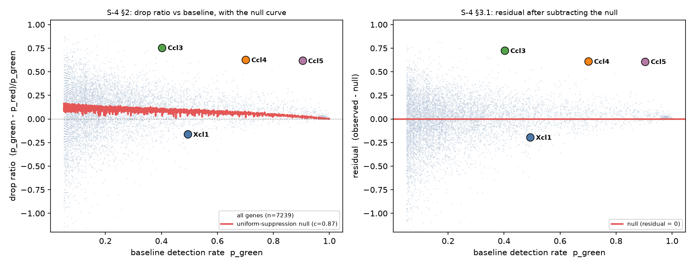

# TARGETED_VS_UNIFORM.md —— S-4 §2 与 §3

> ## 判读（§2.2 预写表，第三行）
> **秩相关显著为正 → 与「普遍抑制」和「定向」两种解释均不符，须单独说明。**
> 原始秩相关 **ρ = +0.033**（基因自助法 [+0.009, +0.056]）；扣除零模型后的残差秩相关 **ρ = +0.128**（[+0.106, +0.151]）。两者皆为正，**符号与「定向」所需的负号相反**。
>
> 按 §5 的预写处置：§3.1 的零模型**已建成并通过阳性对照的效力检验**，故不写「无法判定」。但**也不写「定向」**——数据不支持它。

---

## 0. 一处必须先说破的事：§2.2 的判读规则不能直接用在原始相关系数上

§3.1 警告过检出率的 0–1 边界会自己制造负相关。**实测结果比警告更强：**

> **在「全体细胞按同一比例下调」的零模型下，秩相关在每一个抑制强度上都是 −0.70 到 −0.77。**

也就是说，**若观察到 ρ ≈ −0.7，那恰恰是「普遍抑制」的预期形状，而不是「定向」的证据**。§2.2 的表把「显著为负」判作「定向」，这在检出率这一指标上不成立。

**唯一可用的量是残差**：观测值减去零模型在同一基线上的预测值。全文以下均按此执行。

---

## 1. §3.1 零模型

### 1.1 为什么可以做非参数零模型：计数可精确还原

`DW_T_NK.h5ad` 的 `raw.X` 是 `log1p(normalize_total(target_sum = 4648))`，故

$$\text{count} = \operatorname{expm1}(x)\cdot \frac{\text{n\_counts}}{4648}$$

**还原值的整数性误差 < 1 × 10⁻⁴**（抽查 48 个细胞，最小还原值恰为 1.0000）。**使用前已验证**。

### 1.2 零模型：二项稀释（主口径，非参数）

「每个细胞的表达按同一比例 c 下调」在 UMI 层面**就是**二项稀释：`count′ ~ Binomial(count, c)`。对**实测的**绿组计数做稀释，保留了真实的文库大小分布、真实的逐基因均值结构与任何零膨胀——除「UMI 是潜在丰度的泊松抽样」这一 UMI 标准模型外**不作任何额外假设**。这严格强于拟合一条曲线。

### 1.3 零模型：泊松闭式解（对照口径）

$$p_{\text{red}} = 1-(1-p_{\text{green}})^{c} \quad\Longrightarrow\quad \text{降幅}(q)=\frac{q^{c}-q}{1-q},\; q=1-p_{\text{green}}$$

当 $p_{\text{green}}\to 0$ 时趋于 $(1-c)$，当 $p_{\text{green}}\to 1$ 时趋于 0——**天生单调递减**。

两个零模型在全部 c 上的逐基因差异中位数 ≤ **0.023**，彼此吻合。以二项稀释为主口径。

### 1.4 零模型自身产生的相关（**本任务最关键的一张表**）

| c | 零模型的降幅中位数 | **Spearman(p_green, 降幅)** | 基线 0.1 处降幅 | 基线 0.9 处降幅 |
|---|---|---|---|---|
| 0.9 | 0.081 | **−0.700** | 0.089 | 0.016 |
| 0.8 | 0.168 | **−0.745** | 0.181 | 0.038 |
| 0.7 | 0.258 | **−0.754** | 0.275 | 0.065 |
| 0.6 | 0.352 | **−0.767** | 0.371 | 0.100 |
| 0.5 | 0.449 | **−0.764** | 0.469 | 0.148 |
| 0.4 | 0.551 | **−0.766** | 0.570 | 0.212 |
| 0.3 | 0.655 | **−0.763** | 0.672 | 0.303 |
| 0.2 | 0.765 | **−0.755** | 0.779 | 0.435 |
| 0.1 | 0.879 | **−0.714** | 0.888 | 0.638 |

（全部 p ≈ 0）

### 1.5 阳性对照：这个检验看得见「定向」吗

§1 的「定向」＝只有原本高表达的细胞被影响。逐基因实现：**把该基因表达最高的 k 个细胞置零，k = 比例 × 细胞数**。检出细胞数少于 k 的基因全军覆没（降幅 1.0），检出接近全体的基因只掉 k/n——正是 §1 预言的形状。

| 定向比例 | 降幅中位数 | Spearman(原始) | **Spearman(残差 vs 零模型)** |
|---|---|---|---|
| 0.1 | 0.543 | −0.993 | **−0.981** |
| 0.2 | 1.000 | −0.918 | **−0.804** |
| 0.3 | 1.000 | −0.812 | **−0.518** |
| 0.5 | 1.000 | −0.601 | +0.042（饱和：绝大多数基因已降到 0） |

> **残差检验对定向有强效力，且方向为负**（比例 ≤ 0.3 时 ρ_残差 = −0.98 ~ −0.52）。
> **实测残差为 +0.128。** 不仅没有定向信号，方向还相反。

### 1.6 一处身份不可分辨的问题，声明一次，不绕过

绿红两个文库的**测序深度差异**在检出率上与**全局抑制**完全等价（绿中位 5,645 UMI，红 5,282，比值 **0.936**）。因此 c 同时吸收了这两者。**本分析检验的是形状（对基线的依赖），不是全局水平；全文不对全局水平作任何主张。**

---

## 2. §2 主分析

### 2.1 基因门槛：只卡基线侧，**不卡红侧**

门槛：`p_green ≥ 0.05` 且绿组阳性细胞 ≥ 10 → **7,239 个基因**通过。

> **此处刻意偏离 S-3 的双侧门槛（那样只留 6,753 个）。** 对红侧设门槛就是**对结局设门槛**，会恰好删掉降幅最大的那些基因——而它们正是 §2 要问的对象。这是选择性偏倚，不是稳健性。

### 2.2 降幅比例的分布

| 量 | 值 |
|---|---|
| 中位数 | **+0.106** |
| 四分位距 | **[−0.020, +0.234]** |
| 极差 | [−5.41, +0.90] |
| **下降的基因（降幅 > 0）** | 5,199（**71.8%**） |
| **上升的基因（降幅 < 0）** | 2,039（**28.2%**） |

> **须注意：全局根本没有强抑制。** 降幅中位数只有 10.6%，而其中相当一部分可由 6.4% 的深度差解释（§1.6）。**近三成基因是上升的**——「降幅比例」这一指标把上升记为负值，与 §2 的措辞（默认一切都在下降）不符，此点在 §4 的解释里起作用。

### 2.3 秩相关与自助法区间

| 量 | 估计 | 95% 区间 |
|---|---|---|
| **原始 Spearman(p_green, 降幅)** | **+0.0333**（p = 0.0046） | 基因自助法 **[+0.0091, +0.0562]** |
| 同上，细胞自助法（颜色×时点内重抽，300 次） | +0.0878 | **[+0.0588, +0.1161]** |
| **残差 Spearman（对 c = 0.87 的零模型）** | **+0.1282**（p = 6.9 × 10⁻²⁸） | 基因自助法 **[+0.1060, +0.1509]** |

细胞自助法只含抽样噪声；颜色与文库完全共线，故文库间与个体间方差在此不可见（S-3 A2）。

零模型的 c 由**水平匹配**定出：细网格搜索使零模型的降幅中位数等于实测的 0.1060 → **c = 0.87**（零模型降幅中位数 0.1067）。另以**深度隐含的 c = 0.936** 复算，残差相关为 **+0.077**（p = 4.7 × 10⁻¹¹），同为正。

### 2.4 §2.3 两个已知点的复核

| 基因 | §2.3 降幅 | 实测绿 | 实测红 | **实测降幅** | 零模型降幅 | **残差** |
|---|---|---|---|---|---|---|
| `Ccl3` | 0.778 | 0.4026 | 0.0985 | **0.7554** | 0.0312 | **+0.7242** |
| `Ccl5` | 0.597 | 0.9039 | 0.3462 | **0.6170** | 0.0090 | **+0.6081** |

**降幅比例复现良好**（0.778→0.755；0.597→0.617），尽管两个基因的**绝对检出率**与 §2.3 所引数值相差很大（`Ccl3` 绿 12.59% 对实测 40.26%——同一问题已记于 `CLAIMS_S3.md` B2/B6）。**比值稳、水平不稳**，这一点须一并带走。

**但两个点提示的「基线低者降幅更大」在全基因层面不成立**：`Ccl3` 基线 0.40、`Ccl5` 基线 0.90，两者降幅相近（0.755 与 0.617），而 7,239 个基因的总体相关是 **+0.033**。**两个点确实不构成趋势——§2.3 自己已如此说明，实测证实了这一保留。**

---

## 3. §3.2 均值回归

绿组细胞在每个时点内随机对半分，**基线取自 A 半、降幅由 B 半计算**，两者不共用任何细胞；重复 200 次。

| 设计 | Spearman | 95% 区间 |
|---|---|---|
| 朴素（两侧同一批细胞） | +0.0996 | [+0.0720, +0.1281] |
| **对半分，原始降幅** | **−0.0157** | **[−0.0375, +0.0061]** ← **跨零** |
| **对半分，对零模型的残差** | **+0.0683** | [+0.0468, +0.0899] |

**读法**：

1. 均值回归**确实存在**，且它把原始相关往**正**的方向推（朴素 +0.100 → 对半分 −0.016）。这与 §3.2 的预期方向相反——§3.2 担心的是它制造**虚假的负相关**。
2. **消除均值回归后，原始相关落回零**（区间跨零）。
3. **残差相关仍为正**（+0.068，区间不含零）。

> 三种处理下，**没有任何一种给出负相关**。§2.2 判「定向」所需的负号，在任何设计下都没有出现。

---

## 4. §3.3 按平均表达量分层

按绿组的逐基因平均 UMI 分十分位，层内重算。

| 十分位 | n | 平均 UMI/细胞 | p_green 范围 | ρ(原始) | **ρ(残差)** | p(残差) |
|---|---|---|---|---|---|---|
| 1 | 630 | 0.063 | 0.052–0.070 | +0.057 | +0.052 | 0.19 |
| 2 | 772 | 0.083 | 0.052–0.096 | +0.015 | +0.002 | 0.95 |
| 3 | 729 | 0.113 | 0.057–0.127 | +0.116 | **+0.102** | 0.0058 |
| 4 | 745 | 0.150 | 0.065–0.161 | +0.084 | +0.071 | 0.053 |
| 5 | 733 | 0.193 | 0.094–0.205 | +0.086 | +0.070 | 0.058 |
| 6 | 732 | 0.254 | 0.091–0.257 | +0.119 | **+0.105** | 0.0045 |
| 7 | 726 | 0.347 | 0.094–0.338 | −0.011 | −0.024 | 0.52 |
| 8 | 723 | 0.491 | 0.161–0.452 | +0.057 | +0.052 | 0.16 |
| 9 | 724 | 0.803 | 0.132–0.675 | +0.047 | +0.065 | 0.082 |
| **10** | 725 | 4.980 | 0.119–1.000 | **−0.240** | **−0.047** | 0.21 |

ρ(残差) 的中位数 **+0.059**，10 层中 **8 层为正**。

**关键的一层是第 10 层**：原始相关 **−0.240**（这是全表唯一一个像样的负相关），**扣除零模型后降为 −0.047 且不显著**。即：**高表达层出现的负相关，正是天花板效应造成的，被零模型完整解释掉。** §3.3 担心的混杂确实存在，且已被 §3.1 的零模型处理。

---

## 5. §2.2 的判读，逐行核对

| §2.2 的行 | 是否成立 |
|---|---|
| 秩相关不显著异于零 → 普遍抑制 | **部分**：对半分设计下的原始相关 −0.016 [−0.038, +0.006] **确实跨零**；但残差相关 +0.128 不跨零 |
| 秩相关显著为**负** → 定向 | **不成立**。任何口径下都没有出现显著的负相关；而零模型自身给出 −0.70 ~ −0.77，说明这条规则的方向判定本身有误 |
| **秩相关显著为正 → 与两种解释均不符，须单独说明** | **成立，本轮落在此行** |

### 5.1 单独说明：正号意味着什么

残差为正且与基线正相关，意味着**高基线基因掉得比「普遍抑制」预期的更多，低基线基因掉得比预期的更少**——与「变化集中在原本高表达的少数细胞」**方向相反**。

三条互不依赖的解释，本数据无法在它们之间裁决：

1. **上升的基因集中在低基线端。** 28.2% 的基因是上升的（降幅为负）。红组细胞处在另一套程序里（S-3 已见 `Itga1`、`Cd160` 上升），若上升集中在低基线基因，就会把低基线端的降幅压低，产生正相关。
2. **过度离散的残余。** 二项稀释对**观测计数**操作，已保留生物学层面的爆发性；但若抑制不是严格乘性的，残差会有系统性偏离。
3. **绿红是两批不同的细胞。** 稀释绿组细胞永远造不出红组的**构成**差异。这是本设计的固有限制，与 S-3 §7 是同一条。

### 5.2 效应量须写准，不得放大

ρ(残差) = **+0.128**，在 7,239 个基因上。这是一个**很小**的效应——它足以说明「不是定向」，**不足以**支撑任何关于机制方向的正面主张。

**本任务的结论到此为止：**

> **这个下调不是「只发生在原本高表达的那一小群身上」。**
> 全基因层面的形状与「全体按同一比例下调」几乎一致，残余偏离很小且方向与定向相反。
> **但请注意：全局本身就没有强抑制**（降幅中位数 10.6%，其中含 6.4% 的深度差）。**真正需要解释的不是全局，而是少数极端离群的基因——这正是 §4 的问题。**

---

## 6. 未做

- 未区分定向沉默与定向清除（§6；需凋亡读数）
- 未估计任何占比（§6；S-3 的占比框架已按 §0 判为不成立）
- 未重新下载数据、未重跑全矩阵扫描（读的是同一个 `DW_T_NK.h5ad`）
- 未对红侧设门槛（即未对结局设门槛）
- 未把零模型未通过时的「无法判定」处置误用——零模型已建成并通过效力检验

产出：`results/s4_null_grid.csv`、`results/s4_residual_test.csv`、`results/s4_per_gene_full.csv`、`results/s4_strata.csv`、`results/s4_null_model.log`、`results/s4_main.log`、`S4_PLOTS/scatter.png`；脚本 `scripts/s4_null_model.py`、`scripts/s4_main.py`。
