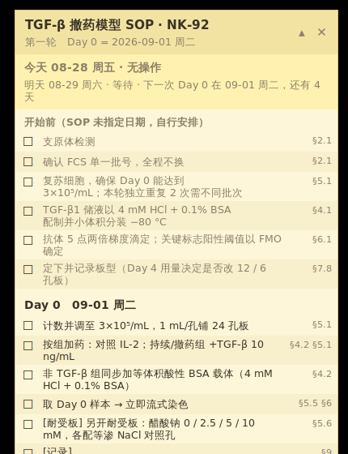

# 右上角 SOP 备忘便签

把 **TGF-β 撤药模型 SOP（NK-92）v1.2 第一轮**的日程钉在屏幕右上角，
置顶显示，勾选状态和窗口位置都会记住。

只用 Python 标准库的 tkinter，不装任何第三方包。



## 跑起来

```bash
python sop_memo/memo.py --day0 2026-09-01
```

`--day0` 就是铺板当天。不写的话默认取「下一个周二」。

| 参数 | 作用 |
|---|---|
| `--day0 YYYY-MM-DD` | 指定 Day 0（铺板当天） |
| `--decorated` | 保留系统窗口边框（无边框窗口在你系统上不听话时用） |
| `--reset` | 清空勾选记录与记住的位置 |
| `--notify-at HH:MM` | 每天几点发通知中心提醒，缺省 `09:00` |
| `--no-notify` | 完全不发通知，只留便签 |
| `--test-notify` | 立刻发一条测试通知然后退出 |

只想要一份纯文本日程贴进实验记录本：

```bash
python sop_memo/schedule.py --day0 2026-09-01
```

## 开机自启

**Windows**　新建 `sop备忘.bat`，内容一行（`pythonw` 不弹黑框）：

```bat
pythonw C:\路径\到\sop_memo\memo.py --day0 2026-09-01
```

按 `Win+R`，输入 `shell:startup`，把这个 `.bat` 拖进去。

**macOS**　新建 `sop备忘.command` 并 `chmod +x`：

```bash
#!/bin/bash
python3 /路径/到/sop_memo/memo.py --day0 2026-09-01
```

系统设置 → 通用 → 登录项，把它加进去。

**Linux**　`~/.config/autostart/sop-memo.desktop`：

```ini
[Desktop Entry]
Type=Application
Exec=python3 /路径/到/sop_memo/memo.py --day0 2026-09-01
Name=SOP 备忘
```

## 顶部面板随时间走

便签最上面那块跟着日子变，不用自己去日程里找位置：

```
今天 08-30 周日 · 无操作
明天 08-31 周一 · 等待 · 下一次 Day 0 在 09-01 周二，还有 2 天
⏰ 还有 2 天就是 Day 0（09-01 周二）：计数并调至 3×10⁵/mL，1 mL/孔铺 24 孔板
```

- **今天**：有操作就写 `Day N · 几项`，没有就写「无操作」。
- **明天**：有操作照样写 `Day N · 几项`；明天还是等着的话，写明要等到几号、还有几天。
- **⏰ 提前预告**：只在空档长（连续无操作 ≥ 2 天）且离下一个操作日剩 1–2 天时出现，
  顺带带上那天头一件事。空档只有一天不提示 —— 「明天」那行已经说完了。

下面的完整日程也跟着走：过去的日子压暗，视图自动停在今天；Day 0 之前则停在
「开始前」那块，因为那时候要做的就是它。跨过午夜会自动更新，不用重开。

## macOS 通知中心

便签在屏幕角上是被动的，看不见就想不起来，所以每天到点再往通知中心推一条：

```
TGF-β SOP · Day 4
今天 09-05 周六 · 7 项
取样 → 立即流式染色
```

- 缺省 **每天 09:00**，`--notify-at 07:30` 改时间，`--no-notify` 关掉。
- **每天最多一条**，发过就记在状态文件里，重开便签不会重复弹。
- **只在有话说的时候弹**：当天有操作，或者是空档里那 1–2 天的提前预告。
  空闲日安静，不制造噪音。
- **中午才开机也补发**当天那条，不会因为错过 09:00 就跳过。
- 检查是每 5 分钟一次，所以可能比设定时间晚几分钟。

用系统自带的 `osascript display notification`，不装第三方包。非 macOS 上这部分
静默跳过，便签本身照常用。

**先试一条**，因为通知权限是最常见的失败点：

```bash
python sop_memo/memo.py --test-notify
```

没弹出来的话，到 **系统设置 → 通知 → 脚本编辑器**，把通知打开。走 `osascript`
发的通知归在「脚本编辑器」名下，不是单独一个 app。

## 用法

- 点方框或文字打勾，划掉表示做完；再点一次取消。
- 拖标题栏可以挪走，位置会记住；想回到右上角就 `--reset`。
- 右上 `▴ / ▾` 收起／展开。收起后只剩「今天」那一块。
- 跨过午夜会自动把「今天」换掉，不用重开。

状态存在 `~/.tgfb_sop_memo.json`。

## 装不上 tkinter？

Windows / macOS 用 python.org 的官方安装包时 tkinter 是自带的。Linux 上要单装：

```bash
sudo apt install python3-tk     # Debian / Ubuntu
sudo dnf install python3-tkinter # Fedora
```

## 日程从哪来

`schedule.py` 里的相对天原样照抄 SOP，每条都标了出处小节：

| 来源 | 内容 |
|---|---|
| §5.2 | 主板时间表 Day 0 / 2 / 4 / 6 / 8 |
| §5.3 | Day 2、Day 6 全量换液并重铺 |
| §5.4 | Day 4 洗脱 |
| §5.5 | 取样时点 Day 0 / 4 / 8 |
| §5.6 | 并行醋酸钠耐受板，Day 3 读数 |
| §6.2 | 核心六项 |
| §8.1 | Day 8 的判定项 |
| §9 | 每个取样日的填表、拍照、存档 |

「开始前」那一组是 §2.1 / §4.1 / §6.1 / §7.8 里没有排日期的准备动作，
SOP 没规定做的时间，自己安排。

第二轮不排日期：它排在第一轮之后，且浓度依赖 §5.6 耐受板与 §7.2 浓度板，
便签里只列启动条件。

Day 0 = 2026-09-01（周二）时的排期：

| 相对天 | 日期 | 主要操作 |
|---|---|---|
| Day 0 | 09-01 周二 | 铺板、加药、取样；同日另开耐受板 |
| Day 2 | 09-03 周四 | 全量换液重铺，重新加药 |
| Day 3 | 09-04 周五 | 耐受板计数测活率，定下醋酸钠浓度 |
| Day 4 | 09-05 周六 | 取样 → 洗脱 → 回铺 |
| Day 6 | 09-07 周一 | 全量换液重铺，重新加药 |
| Day 8 | 09-09 周三 | 终点取样，核对 §8.1 判定项 |
